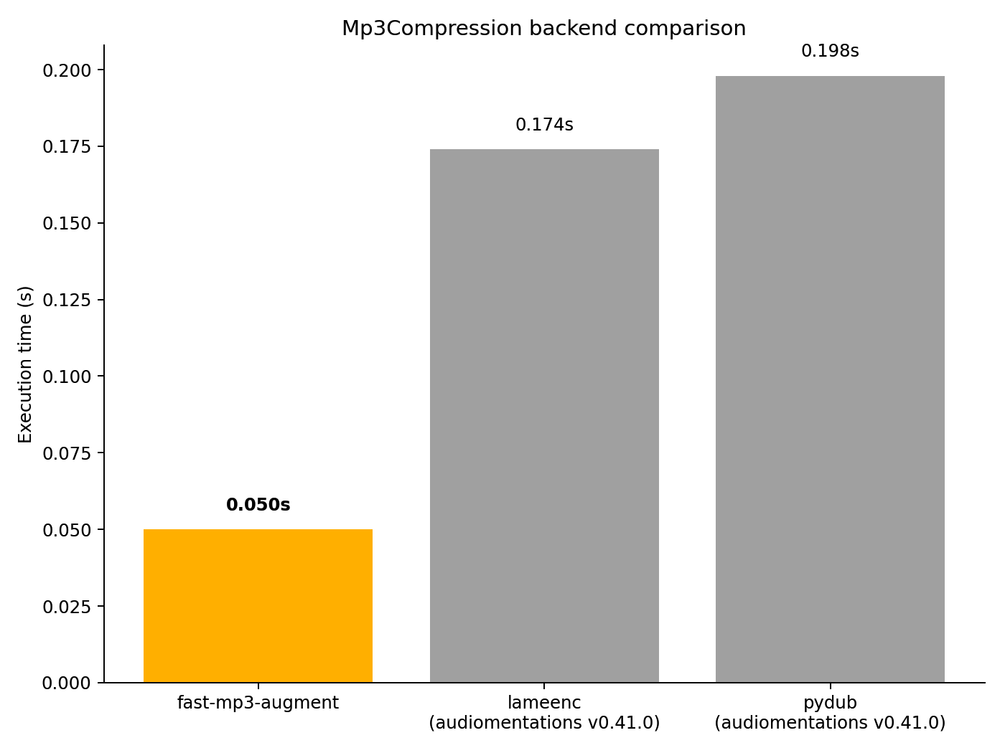

# fast-mp3-augment

A fast Python library for MP3 encoder + decoder data augmentation. Made for integration with [audiomentations](https://github.com/iver56/audiomentations/). Intentionally applying audio degradation by lossy compression help machine learning models learn to deal with compressed, low-quality audio found in the real world.

## Code example

```
import numpy as np

import fast_mp3_augment

audio = np.random.uniform(-1, 1, (2, 2 * 48000)).astype("float32")
augmented_audio = fast_mp3_augment.compress_roundtrip(
    audio, sample_rate=48000, bitrate_kbps=64, preserve_delay=False, quality=7
)
```

## Features

* The output is perfectly aligned (no delay/offset and padding) with the input by default, but this trimming behavior can be disabled (with `preserve_delay=True`)
* Supports mono and stereo
* Supports standard MP3 bitrates (8-320 kbps)
* Supports common sample rates (8-48 kHz)
* Inputs and outputs float32 numpy array
* Adjustable `quality` parameter for various tradeoffs between speed and audio quality

## Performance

This library is largely developed with Rust under the hood (via pyo3 & maturin), and applies a few nice little tricks for achieving speedy execution (which is important during large-scale audio ML training!), such as:

* Fast numpy array interop between Python and rust
* In-memory computations (no disk I/O)
* SIMD-optimized max abs calculation (for avoiding clipping distortion)
* Pipelining/streaming (LAME encoder and minimp3 decoder in separate threads)

A quick performance benchmark (based on demo.py in audiomentations), which augmented 3 short (~7-9 sec) audio snippets (2 mono, 1 stereo) on a laptop with i7-13700HX and a 2 TB Samsung PM9A1 NVMe shows that fast-mp3-augment is superior when it comes to speed:



## Development setup

* `conda create --name fast-mp3-augment python=3.11`
* `conda activate fast-mp3-augment`
* `pip install -r dev_requirements.txt`
* `maturin develop`
* `pytest`

## LAME note

fast_mp3_augment statically links libmp3lame 3.100 (LGPL-2.1-or-later). Full source is available [here](https://downloads.sourceforge.net/project/lame/lame/3.100/lame-3.100.tar.gz). To rebuild the wheel against a modified LAME, see [mp3lame-sys](https://crates.io/crates/mp3lame-sys)
